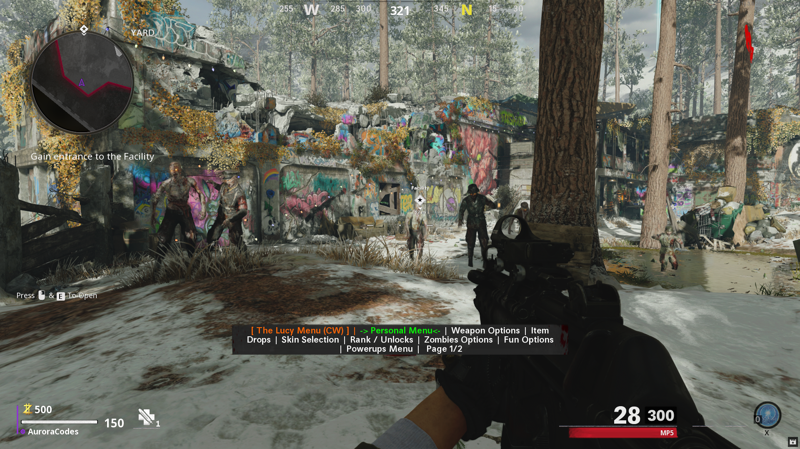

[![Contributors][contributors-shield]][contributors-url]
[![Forks][forks-shield]][forks-url]
[![Stars][stars-shield]][stars-url]
[![Issues][issues-shield]][issues-url]

<!-- PROJECT LOGO -->
 

  
  <h3 align="center">The Lucy Menu</h3>

  

	A Free, Open Source, Fully Maintained Cold War Zombies Menu Base Made in GSC.
     
    <a href="https://github.com/TheUnknownCod3r/ColdWar-Lucy-Base/issues">Report Bug</a>
    ·
    <a href="https://github.com/TheUnknownCod3r/ColdWar-Lucy-Base/issues">Request Feature</a>
  

<!-- TABLE OF CONTENTS -->

  
Table of Contents

  <ol>
    <li><a href="#prerequisites">Prerequisites</a></li>
    <li><a href="#usage">Usage</a></li>
    <li><a href="#roadmap">Roadmap</a></li>
    <li><a href="#contributing">Contributing</a></li>
	  <li><a href="#changelog">Changelog</a></li>
    <li><a href="#acknowledgments">Acknowledgments</a></li>
    <li><a href="#mods-using-this">Mods Using The Base</a></li>
  </ol>

### Prerequisites

To use this Mod Menu, You must have t7 compiler installed, and I have supplied a GUI app to make it easy: https://github.com/AuroraDoesCode/Black-Ops-GSC-Compiler-Frontend/releases \
You can download T7 Compiler [Here](https://github.com/auroradoescode/t7-compiler-custom/releases/) Run the t7c-installer.exe \
Visual Studio Code can be obtained [Here](https://code.visualstudio.com/) if you want to edit a custom version, or supply your own changes.

(<a href="#top">back to top</a>)

<!-- USAGE EXAMPLES -->
## Usage
	To use the Menu, follow the below Instructions.

	1. Click the link above and download the GUI frontend for GSC Injection. 
	2. Install T7 Compiler via the link Above, this is a custom fork with BO3, BO4, AND BOCW Support.
	3. Go to the Releases section, and download the latest Compiled.gscc linked there. This is your Menu script. Save it to your desktop.
	4. Open the Frontend app you downloaded earlier, Hit Load Script, and go to your Desktop, Select the Compiled.gscc you downloaded earlier, and open it. 
	5. If everything is correct, the GSC should appear in the box on the right. In the second Box, Select Zombies, and Tick the "T9" Checkbox". This tells the Injector to target Cold War.
	6. Load Black Ops Cold War, go to Zombies, load into a match and quit match once you can move. This is to prepare the Engine to receive Injection scripts.
	7. In the GUI Frontend, hit Inject Script. If everything goes well, you'll get a popup saying Injection Successful, and you can start a match. 

	Visual Studio Code Instructions:

	1. Download a copy of the Repository by clicking Code> Download Zip
	
	2. Load Visual Studio Code, Click File, Open Workspace, and load the Project.workspace in the ColdWar-Lucy-Base Folder you downloaded. Make sure you have your Keyboard shortcut for Run Test Task.
	
	3. Load Black Ops Cold War, Go into a Zombies Lobby, Load a game ONCE, then back out into the zombies lobby, before hitting Inject
	
	4. Once the game loads, You should be able to Aim and Knife to open the menu. You will know if it is running as you will see a message on screen.
	
	

(<a href="#top">back to top</a>)

<!-- ROADMAP -->
## Roadmap

(<a href="#top">back to top</a>)

<!-- CONTRIBUTING -->
## Contributing

Contributions by the community are welcome, as are Bug Fixes, and suggestions. If you have an idea You wanna make and add, here's how you can contribute!

1. Fork the Project
2. Create a new branch and in the name, add -add-yourchanges
3. Apply and test your changes
4. If no issues occur, Submit a Pull request, and we'll check everything before accepting!

(<a href="#top">back to top</a>)

## Changelog

Version 1.0

	

		Version 1.0
	

	- Source Code Publish!

<!-- ACKNOWLEDGMENTS -->
## Acknowledgments

This wouldn't be possible without the following people

* [ate47](https://www.github.com/ate47/T7-compiler-custom)
	without his custom T7 Compiler, Cold War GSC Injection wouldn't be possible.

* [TheUnknownCod3r](https://www.github.com/TheUnknownCod3r/)
	Original Base release
* [C0mpile](https://github.com/c0mpile)
  	Provided several functions
* [Omnidg](https://github.com/omnidg)
  	Provided the Item spawner Scripts, Helped with several other scripts inc PAP and weapons.

(<a href="#top">back to top</a>)

<!-- UsingTheMod -->
## Mods Using This

These are mods that are currently utilising this code base, either on Cold War, or Black Ops 4.

* [Phantom T8](https://github.com/Lurkzy/phantom-t8) (Discontinued)
      Phantom T8, A BO4 Multiplayer Mod Menu

(<a href="#top">back to top</a>)

## Known menu skids

* [MrJasonDex / ModdingX](https://www.github.com/MrJasonDex/) or whatever he calls himself - Claiming credit for the menu even though his only contribution was whining like a bitch in my dm, lmao. Grow up, kid. 

<!-- MARKDOWN LINKS & IMAGES -->
<!-- https://www.markdownguide.org/basic-syntax/#reference-style-links -->
[contributors-shield]: https://img.shields.io/github/contributors/TheUnknownCod3r/ColdWar-Lucy-Base.svg?style=for-the-badge
[contributors-url]: https://github.com/TheUnknownCod3r/ColdWar-Lucy-Base/graphs/contributors
[forks-shield]: https://img.shields.io/github/forks/TheUnknownCod3r/ColdWar-Lucy-Base.svg?style=for-the-badge
[forks-url]: https://github.com/TheUnknownCod3r/ColdWar-Lucy-Base/network/members
[stars-shield]: https://img.shields.io/github/stars/TheUnknownCod3r/ColdWar-Lucy-Base.svg?style=for-the-badge
[stars-url]: https://github.com/TheUnknownCod3r/ColdWar-Lucy-Base/stargazers
[issues-shield]: https://img.shields.io/github/issues/TheUnknownCod3r/ColdWar-Lucy-Base.svg?style=for-the-badge
[issues-url]: https://github.com/TheUnknownCod3r/ColdWar-Lucy-Base/issues
[license-shield]: https://img.shields.io/github/license/TheUnknownCod3r/ColdWar-Lucy-Base.svg?style=for-the-badge
[license-url]: https://github.com/TheUnknownCod3r/ColdWar-Lucy-Base/blob/master/LICENSE.txt
